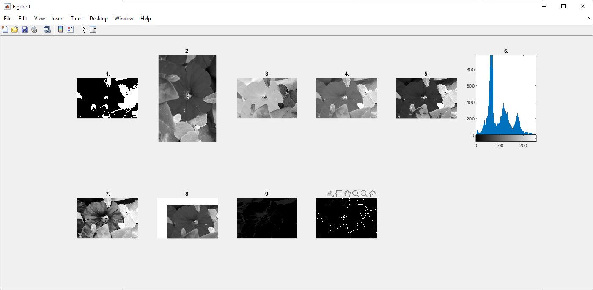

# Basic Image Processing Operations

Apply following operations to the given image in Matlab. Consider every operation individually. Display results in 2*5 grid.
(The image have to be converted to grayscale at first.)

1.  Convert the image pixel values to between 0..1
2.  Rotate the image 90 degree clockwise.
3.  Apply negation operation to the image.
4.  Increase the image pixel values by 40
5.  Multiply the image pixel values by 0.75 if below 100, multiply 1.25 if above 100
6.  Obtain histogram of the image.
7.  Apply histogram equalization to the image
8.  Shift the image 20 pixel from the left, 30 pixel from the top
9.  Subtract to result of the 7th entry from the image
10.  Determine edges of the image

### Screenshot
 

'basic_operations.m' file :

```matlab
img = imread("image1.jpeg");
gray = rgb2gray(img);
blackWhite = im2bw(gray);
rotated = rot90(gray, 3);
negative = imcomplement(gray);
bright = gray + 40;
for x=1:size(gray, 1)
for y=1:size(gray, 2)
if gray(x,y) < 100
bright2(x,y) = gray(x,y)*0.75;
else
bright2(x,y) = gray(x,y)*1.25;
end
end
end

histEqual = histeq(gray);
shift = imtranslate(gray,[25.3, -10.1],'FillValues',255);
shift = imtranslate(shift,[20, 30],'FillValues',255);
subtracted = imsubtract(gray, histEqual);
detectedEdges = edge(gray, 'prewitt');

figure1=figure('Position', [0, 0, 1400, 600]);

subplot(2,6,1);
imshow(blackWhite);
title("1.");

subplot(2,6,2);
imshow(rotated);
title("2.");

subplot(2,6,3);
imshow(negative);
title("3.");

subplot(2,6,4);
imshow(bright);
title("4.");

subplot(2,6,5);
imshow(bright2);
title("5.");

subplot(2,6,6);
imhist(gray);
title("6.");

subplot(2,6,7);
imshow(histEqual);
title("7.");

subplot(2,6,8);
imshow(shift);
title("8.");

subplot(2,6,9);
imshow(subtracted);
title("9.");

subplot(2,6,10);
imshow(detectedEdges);
title("10.");
```