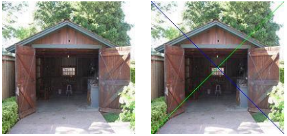

# Colored Diagonals

Write a matlab function that add black diagonal line and green counter-diagonal line to the given image.



'diagonal.m' file :

```matlab
function imgReturn=diagonal(img)
imgReturn = img;
for i=1:size(img,1)
    for j=1:size(img,2)
        if (i==j)
            imgReturn(i,j,1)=0;
            imgReturn(i,j,2)=0;
            imgReturn(i,j,3)=0;
        elseif (i+j==(size(img,2)+1))
            imgReturn(i,j,1)=0;
            imgReturn(i,j,2)=255;
            imgReturn(i,j,3)=0;
        end
    end
end
end
```