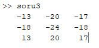
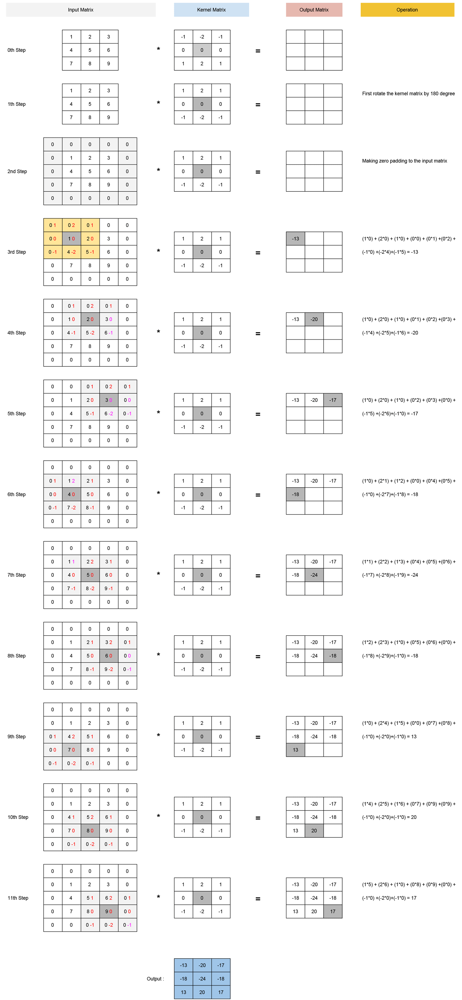

# Convolution

Execute convolution operation by traversing the given kernel matrix over the given input matrix. And find 3*3 sized output matrix occured as a result of the operation. 

### Screenshot



'conv_example.m' file :

```matlab
inputM = [1 2 3;4 5 6;7 8 9];
kernel = [-1 -2 -1;0 0 0;1 2 1];

disp(conv2(inputM,kernel,'same'));
```

###  Operation
