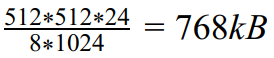
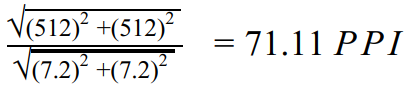

# File size and PPI calculation

A 512*512 pixel sized colored image has 24 bit/pixel depth. 

1) How much does it takes up disk space?

2) If the physical dimensions sets 7.2" * 7.2", what is the PPI value?

