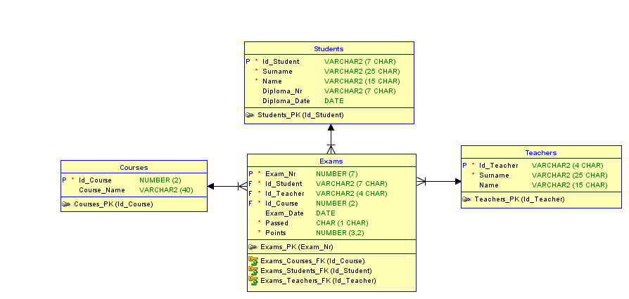

# SQL Tasks



There are the following tables you have to use to solve the tasks defined the next chapters:

- Teachers – persons who assess the exams,
- Students – people who take the exam,
- Courses – area of education that has to be completed by passing an exam,
- Exams – an exam from the course.  


1. Select all students whose surname is Smith. Display student ID, name and surname.
   Sort the result set by surname in descending order.  

   ```sql
   SELECT ID_STUDENT, NAME, SURNAME FROM STUDENTS WHERE SURNAME='Smith' ORDER BY SURNAME DESC;
   ```


2. Display the course name that contains the character string "data". 

   ```sql
   SELECT COURSE_NAME FROM COURSES WHERE COURSE_NAME LIKE '%data%';
   ```

   
3. Select all exams that have been passed. Display student ID, course ID and number of
points obtained by student from this exam. Sort the result set using student ID and
course ID (both in ascending order). 

   ```sql
   SELECT ID_STUDENT, ID_COURSE, POINTS FROM EXAMS WHERE PASSED='Y' ORDER BY ID_STUDENT ASC, ID_COURSE ASC;
   ```


4. Select courses that have been completed (a positive result of the exam) by all students
whose surname is Smith. Display student ID, name, surname, and course name. 

   ```sql
   SELECT EXAMS.ID_STUDENT, STUDENTS.NAME, STUDENTS.SURNAME, COURSES.COURSE_NAME FROM EXAMS INNER JOIN STUDENTS ON EXAMS.ID_STUDENT=STUDENTS.ID_STUDENT
   INNER JOIN COURSES ON EXAMS.ID_COURSE=COURSES.ID_COURSE WHERE STUDENTS.SURNAME='Smith' AND EXAMS.POINTS > 0;
   ```


5. Select teachers who assessed the exams from the course "Data warehouses". Display
teacher ID, name and surname. Sort the result set using teacher's surname.

   ```sql
   SELECT TEACHERS.ID_TEACHER, TEACHERS.NAME, TEACHERS.SURNAME FROM EXAMS INNER JOIN TEACHERS ON EXAMS.ID_TEACHER=TEACHERS.ID_TEACHER INNER JOIN COURSES 
   ON EXAMS.ID_COURSE=COURSES.ID_COURSE WHERE COURSES.COURSE_NAME='Data warehouses' ORDER BY TEACHERS.SURNAME; 
   ```

6. Which students took an exam and did not passed an exam? Display student ID, name
and surname, and sort the result set by student's surname in descending order

   ```sql
   SELECT STUDENTS.ID_STUDENT, STUDENTS.NAME, STUDENTS.SURNAME FROM EXAMS INNER JOIN STUDENTS ON EXAMS.ID_STUDENT=STUDENTS.ID_STUDENT WHERE EXAMS.PASSED='N'
   ORDER BY STUDENTS.SURNAME DESC; 
   ```

7. Who among students did not take any exam, yet? Display his/her student ID, name and
surname. Sort the result set by student ID.

   ```sql
   SELECT ID_STUDENT, NAME, SURNAME FROM STUDENTS WHERE NOT EXISTS (SELECT ID_STUDENT FROM EXAMS WHERE STUDENTS.ID_STUDENT=EXAMS.ID_STUDENT) 
   ORDER BY ID_STUDENT;
   ```

8. Which student has been assessed (taking an exam) by the teacher whose surname is
Muryjas. For each teacher with this surname, display student ID, student name and
surname.

   ```sql
   SELECT ID_STUDENT, NAME, SURNAME FROM STUDENTS WHERE ID_STUDENT IN 
   (SELECT ID_STUDENT FROM EXAMS INNER JOIN TEACHERS ON EXAMS.ID_TEACHER=TEACHERS.ID_TEACHER WHERE SURNAME='Muryjas');
   ```


9. How many exams have been passed by the students? Consider in the result set only
those students who took an exam. Display student ID, name, surname, and a number of
exams. Apply the label "Number of exams" for the last column. Sort the result set by the
number of exams in descending order.

   ```sql
   select exams.id_student, students.name, students.surname, count(exams.id_student) as "Number of exams" from exams inner join students on exams.id_student=students.id_student
   where exams.passed = 'Y'
   group by exams.id_student, students.name, students.surname order by "Number of exams" asc;
   ```


10. How many exams have been passed by every student? Consider in the result set all
students. Display student ID, name, surname, and a number of exams. Apply the label
"Number of exams" for the last column. Sort the result set by the number of exams in
ascending order.

      ```sql
      select exams.id_student, students.name, students.surname, count(exams.id_student) as "Number of exams" from exams inner join students on exams.id_student=students.id_student
      where exams.passed = 'Y'
      group by exams.id_student, students.name, students.surname order by "Number of exams" desc;
      ```


11. How many points have been collected by every student who took at least one exam?
Display student ID, name, surname, and the total number of points. Apply an appropriate
label to the last column. Sort the result set using the last column applying a descending
order.

      ```sql
      SELECT EXAMS.ID_STUDENT, STUDENTS.NAME, STUDENTS.SURNAME, SUM(EXAMS.POINTS) as "Total Point" FROM EXAMS INNER JOIN STUDENTS ON EXAMS.ID_STUDENT=STUDENTS.ID_STUDENT 
      GROUP BY EXAMS.ID_STUDENT, STUDENTS.NAME, STUDENTS.SURNAME ORDER BY "Total Point" DESC;
      ```


12. Which student passed an exam and collected more than 50 points? Display student ID,
name and surname. Apply sorting by number of points in the descending order.

      ```sql
      SELECT EXAMS.ID_STUDENT, STUDENTS.NAME, STUDENTS.SURNAME, SUM(EXAMS.POINTS) AS TOTAL_POINT FROM EXAMS INNER JOIN STUDENTS ON EXAMS.ID_STUDENT=STUDENTS.ID_STUDENT 
      GROUP BY EXAMS.ID_STUDENT, STUDENTS.NAME, STUDENTS.SURNAME
      HAVING SUM(EXAMS.POINTS) > 50
      ORDER BY TOTAL_POINT DESC;
      ```


13. What is the date of the last exam taken by every student? Take into consideration all
students. Display student ID, name, surname, and the date of this exam. Sort result set
using student ID and descending order.

      ```sql
         SELECT STUDENTS.ID_STUDENT, STUDENTS.NAME, STUDENTS.SURNAME, MAX(EXAMS.EXAM_DATE)"Last Exam Date" FROM STUDENTS INNER JOIN EXAMS ON STUDENTS.ID_STUDENT=EXAMS.ID_STUDENT
         GROUP BY STUDENTS.ID_STUDENT, STUDENTS.NAME, STUDENTS.SURNAME
         ORDER BY STUDENTS.ID_STUDENT DESC;
      ```


14. How many exams have been taken for each course? Display the name of the course
and the number of exams. Apply appropriate label for the second column.

      ```sql
         SELECT COURSES.COURSE_NAME, COUNT(EXAMS.ID_COURSE)"Number of Exams" FROM EXAMS INNER JOIN COURSES ON EXAMS.ID_COURSE=COURSES.ID_COURSE 
         GROUP BY COURSES.ID_COURSE, COURSES.COURSE_NAME;
      ```


15. How many students have taken exams from particular courses? Consider only those
courses for which there is at least one exam. Display the name of the course and the
number of students. Apply appropriate label for the second column.

      ```sql
         SELECT COURSES.COURSE_NAME, COUNT(EXAMS.ID_STUDENT)"Exam Count" FROM EXAMS INNER JOIN COURSES ON EXAMS.ID_COURSE=COURSES.ID_COURSE 
         GROUP BY COURSES.COURSE_NAME;
      ```


16. How many teachers assessed exams from particular courses? Display the course name
and the number of teachers. Apply appropriate label for the second column. Sort data
using the second column and use the descending order.

      ```sql
         SELECT COURSES.COURSE_NAME, COUNT(ID_TEACHER)"Exam Count" FROM EXAMS INNER JOIN COURSES ON EXAMS.ID_COURSE=COURSES.ID_COURSE 
         GROUP BY COURSES.COURSE_NAME ORDER BY "Exam Count" DESC;
      ```


17. How many exams have been taken in particular years? Display year number and the
number of exams. Apply appropriate labels for both columns. Sort the result set using
the first column (descending order). To help you to solve this task I recommend you to
use the function EXTRACT.

      ```sql
         SELECT EXTRACT(YEAR FROM EXAMS.EXAM_DATE)"YEAR", COUNT(*)"NUMBER OF EXAMS" FROM EXAMS GROUP BY EXTRACT(YEAR FROM EXAMS.EXAM_DATE);
      ```


18. How many exams have been taken in particular months of particular years? Display year
number, month number, and the number of exams. Apply appropriate labels for all
displayed columns. Sort the result set using the first and second column (ascending
order). To help you to solve this task I recommend you to use the function EXTRACT.

      ```sql
         SELECT EXTRACT(YEAR FROM EXAMS.EXAM_DATE) AS "YEAR", EXTRACT(MONTH FROM EXAMS.EXAM_DATE) AS "MONTH", COUNT(*)"EXAM COUNT" FROM EXAMS GROUP BY  EXTRACT(YEAR FROM EXAMS.EXAM_DATE), EXTRACT(MONTH FROM EXAMS.EXAM_DATE)
         ORDER BY YEAR ASC, MONTH ASC;
      ```


19. For each year, select the teacher who assessed more than 100 exams. Display year
number, teacher ID, name and surname, and the number of exams. Apply appropriate
labels for the first and fifth column. Sort data using these columns. To help you to solve
this task I recommend you to use the function EXTRACT.

      ```sql
         SELECT EXTRACT(YEAR FROM EXAMS.EXAM_DATE) AS "YEAR", EXAMS.ID_TEACHER, TEACHERS.NAME, TEACHERS.SURNAME, COUNT(*) AS "EXAM COUNT" FROM EXAMS 
         INNER JOIN TEACHERS ON EXAMS.ID_TEACHER=TEACHERS.ID_TEACHER
         GROUP BY EXTRACT(YEAR FROM EXAMS.EXAM_DATE), EXAMS.ID_TEACHER, TEACHERS.NAME, TEACHERS.SURNAME
         HAVING COUNT(*) > 100
         ORDER BY "YEAR", "EXAM COUNT";
      ```


20. For each month of each year, select the teacher who assessed more than 8 students.
Display year number, month number, teacher ID, name and surname, and the number of
assessed students. Apply appropriate labels for the first, second and sixth column. Sort
two first columns. To help you to solve this task I recommend you to use the function
EXTRACT.

      ```sql
         SELECT EXTRACT(YEAR FROM EXAMS.EXAM_DATE) AS "YEAR", EXTRACT(MONTH FROM EXAMS.EXAM_DATE) AS "MONTH", EXAMS.ID_TEACHER, TEACHERS.NAME, TEACHERS.SURNAME, COUNT(*) AS "EXAM COUNT" FROM EXAMS 
         INNER JOIN TEACHERS ON EXAMS.ID_TEACHER=TEACHERS.ID_TEACHER
         GROUP BY EXTRACT(YEAR FROM EXAMS.EXAM_DATE), EXTRACT(MONTH FROM EXAMS.EXAM_DATE), EXAMS.ID_TEACHER, TEACHERS.NAME, TEACHERS.SURNAME
         HAVING COUNT(*) > 8
         ORDER BY "YEAR", "MONTH";
      ```


21. Which course has been assessed on the last day of exams? Display the date and the
name of the course. Use an appropriate label for both columns. Use subquery to solve
this task.

      ```sql
         SELECT EXAMS.EXAM_DATE, COURSES.COURSE_NAME FROM EXAMS 
         INNER JOIN COURSES ON EXAMS.ID_COURSE=COURSES.ID_COURSE
         WHERE EXAM_DATE = (SELECT MAX(EXAM_DATE) FROM EXAMS); 
      ```


22. Which students have passed an exam from the course "Database fundamentals" on the
day that was the last day of exams of this course? Display Id student, name and
surname. Sort results set by student ID. Use subquery to solve this task

      ```sql
         SELECT EXAMS.ID_STUDENT, STUDENTS.NAME, STUDENTS.SURNAME FROM EXAMS 
         INNER JOIN STUDENTS ON EXAMS.ID_STUDENT=STUDENTS.ID_STUDENT
         INNER JOIN COURSES ON EXAMS.ID_COURSE=COURSES.ID_COURSE
         WHERE COURSES.COURSE_NAME='Database fundamentals'
         AND EXAMS.EXAM_DATE = (SELECT MAX(EXAMS.EXAM_DATE) FROM EXAMS INNER JOIN COURSES ON EXAMS.ID_COURSE = COURSES.ID_COURSE WHERE COURSES.COURSE_NAME = 'Database fundamentals')
         AND EXAMS.PASSED = 'Y';
      ```


23. Which teacher has assessed the greatest number of exams? Display teacher ID, name
and surname. Sort the result set by teacher surname. Which teacher has assessed the
greatest number of exams? Display teacher ID, name and surname. Sort the result set
by teacher surname. Use subquery to solve this task.

      ```sql
         SELECT MAX(COUNT(*)) FROM EXAMS GROUP BY ID_TEACHER;

         SELECT ID_TEACHER FROM EXAMS GROUP BY ID_TEACHER 
         HAVING COUNT(ID_TEACHER)=(SELECT MAX(mycount) FROM (SELECT ID_TEACHER, COUNT(ID_TEACHER) AS mycount FROM EXAMS GROUP BY ID_TEACHER));
      ```

         
      ```sql
         SELECT EXAMS.ID_TEACHER, TEACHERS.NAME, TEACHERS.SURNAME FROM EXAMS 
         INNER JOIN TEACHERS ON EXAMS.ID_TEACHER=TEACHERS.ID_TEACHER
         GROUP BY EXAMS.ID_TEACHER, TEACHERS.NAME, TEACHERS.SURNAME
         HAVING COUNT(EXAMS.ID_TEACHER)=(SELECT MAX(mycount) FROM (SELECT ID_TEACHER, COUNT(ID_TEACHER) AS mycount FROM EXAMS GROUP BY ID_TEACHER))
         ORDER BY TEACHERS.SURNAME;
      ```


24. Indicate the course for which there is the greatest number of exams. Display the course
name. Sort the result set by course name. Use subquery to solve this task.

      ```sql
         SELECT COURSES.COURSE_NAME FROM EXAMS INNER JOIN COURSES ON EXAMS.ID_COURSE=COURSES.ID_COURSE 
         GROUP BY COURSES.COURSE_NAME, EXAMS.ID_COURSE 
         HAVING COUNT(EXAMS.ID_COURSE) = (SELECT MAX(COUNT(ID_COURSE)) FROM EXAMS GROUP BY ID_COURSE)
         ORDER BY COURSES.COURSE_NAME;
      ```


25. Indicate the student who has passed the greatest number of exams. Display student ID,
name and surname. Sort the result set by student surname. Use subquery to solve this
task.

      ```sql
         SELECT EXAMS.ID_STUDENT, STUDENTS.NAME, STUDENTS.SURNAME FROM EXAMS
         INNER JOIN STUDENTS ON EXAMS.ID_STUDENT=STUDENTS.ID_STUDENT
         WHERE EXAMS.PASSED = 'Y'
         GROUP BY EXAMS.ID_STUDENT, STUDENTS.NAME, STUDENTS.SURNAME
         HAVING COUNT(EXAMS.ID_STUDENT) = (SELECT MAX(COUNT(ID_STUDENT)) FROM EXAMS WHERE PASSED='Y' GROUP BY ID_STUDENT)
         ORDER BY STUDENTS.SURNAME;
      ```


26. Display the year number for which there was the greatest number of exams. Use
subquery to solve this task.

      ```sql
         SELECT EXTRACT(YEAR FROM EXAM_DATE)"YEAR" FROM EXAMS 
         GROUP BY EXTRACT(YEAR FROM EXAM_DATE) 
         HAVING COUNT(EXTRACT(YEAR FROM EXAM_DATE)) = (SELECT MAX(COUNT(EXTRACT(YEAR FROM EXAM_DATE))) FROM EXAMS GROUP BY EXTRACT(YEAR FROM EXAM_DATE)); 
      ```


27. Which course has been passed by every student on the last her/his exam? Take into
consideration only those students who took at least one exam. Display student ID, name
and surname, as well as course name. Sort the result set by student ID. Use subquery to
solve this task.

      ```sql
         SELECT SSS.ID_STUDENT, STUDENTS.NAME, STUDENTS.SURNAME, (SELECT COURSES.COURSE_NAME FROM EXAMS INNER JOIN COURSES ON EXAMS.ID_COURSE=COURSES.ID_COURSE WHERE (ID_STUDENT=SSS.ID_STUDENT) AND (EXAM_DATE = (SELECT MAX(EXAM_DATE) 
         FROM EXAMS 
         WHERE (ID_STUDENT=SSS.ID_STUDENT) AND PASSED='Y')))"LAST PASSED COURSE" FROM STUDENTS SSS 
         INNER JOIN STUDENTS ON SSS.ID_STUDENT=STUDENTS.ID_STUDENT;
      ```


28. Which student has been assessed by particular teachers as the last one? Display
teacher ID, name, and surname as well as student ID, name, and surname. Sort the
result set by teacher surname and student surname. Use subquery to solve this task.

      ```sql
         SELECT DISTINCT EEE.ID_TEACHER, TTT.NAME, TTT.SURNAME, SSS.ID_STUDENT, SSS.NAME, SSS.SURNAME
         FROM EXAMS EEE
         INNER JOIN STUDENTS SSS ON SSS.ID_STUDENT = EEE.ID_STUDENT
         INNER JOIN TEACHERS TTT ON EEE.ID_TEACHER = TTT.ID_TEACHER
         WHERE EEE.ID_STUDENT = (SELECT ID_STUDENT FROM EXAMS WHERE ID_TEACHER=EEE.ID_TEACHER AND EXAM_DATE = 
         (SELECT MAX(EXAM_DATE) FROM EXAMS WHERE ID_TEACHER=EEE.ID_TEACHER ) )
         ORDER BY TTT.SURNAME, SSS.SURNAME
         ;
      ```


29. Which student has been assessed the most times by particular teachers? Display
teacher ID, name, and surname as well as student ID, name, and surname. Sort the
result set by teacher surname and student surname. Use subquery to solve this task.

      ```sql
         SELECT ID_STUDENT FROM EXAMS WHERE ID_TEACHER=9 GROUP BY ID_STUDENT HAVING COUNT(ID_STUDENT) = ( SELECT MAX(MYCOUNT) FROM (SELECT ID_STUDENT, COUNT(ID_STUDENT) AS MYCOUNT FROM EXAMS WHERE ID_TEACHER=9 GROUP BY ID_STUDENT ) );
         SELECT * FROM EXAMS WHERE ID_TEACHER=8 AND ID_STUDENT=16;


         SELECT DISTINCT TTT.ID_TEACHER, TTT.NAME, TTT.SURNAME, SSS.ID_STUDENT, SSS.NAME, SSS.SURNAME FROM TEACHERS TTT INNER JOIN
         EXAMS EEE ON TTT.ID_TEACHER=EEE.ID_TEACHER
         INNER JOIN STUDENTS SSS ON EEE.ID_STUDENT = SSS.ID_STUDENT
         WHERE EEE.ID_STUDENT IN (SELECT ID_STUDENT FROM EXAMS WHERE ID_TEACHER=EEE.ID_TEACHER GROUP BY ID_STUDENT HAVING COUNT(ID_STUDENT) = ( SELECT MAX(MYCOUNT) FROM (SELECT ID_STUDENT, COUNT(ID_STUDENT) AS MYCOUNT FROM EXAMS WHERE ID_TEACHER=EEE.ID_TEACHER GROUP BY ID_STUDENT )))
         ORDER BY TTT.SURNAME, SSS.SURNAME
         ;
      ```


30. For each student, find the completed course from which the student received the
greatest number of points. Display student ID, surname, name, and course name. Sort
the result set by student surname. Use subquery to solve this task.

      ```sql
         SELECT ASDF.ID_STUDENT, STUDENTS.SURNAME, STUDENTS.NAME, COURSES.COURSE_NAME FROM EXAMS ASDF INNER JOIN STUDENTS ON
         ASDF.ID_STUDENT = STUDENTS.ID_STUDENT INNER JOIN COURSES ON 
         ASDF.ID_COURSE = COURSES.ID_COURSE
         GROUP BY ASDF.ID_STUDENT, STUDENTS.SURNAME, STUDENTS.NAME, COURSES.COURSE_NAME
         HAVING MAX(ASDF.POINTS) = (SELECT MAX(POINTS) FROM EXAMS WHERE ID_STUDENT = ASDF.ID_STUDENT);
      ```


31. Which teacher assessed the greatest number of exams in particular years? For each
year, display teacher ID, surname, name, and the number of exams for this teacher. Sort
the result set using year and teacher surname. Use subquery to solve this task.

      ```sql
         SELECT DISTINCT EXTRACT(YEAR FROM EEE.EXAM_DATE), COUNT(EEE.ID_TEACHER) AS MYCOUNT FROM EXAMS EEE GROUP BY EXTRACT(YEAR FROM EEE.EXAM_DATE);

         SELECT EEE.ID_TEACHER, TTT.SURNAME, TTT.NAME, EEE.YEARR FROM (SELECT DISTINCT ID_TEACHER, EXTRACT(YEAR FROM EXAM_DATE) AS YEARR FROM EXAMS) EEE INNER JOIN TEACHERS TTT ON EEE.ID_TEACHER=TTT.ID_TEACHER
         WHERE EEE.ID_TEACHER = ()
         ; 
      ```